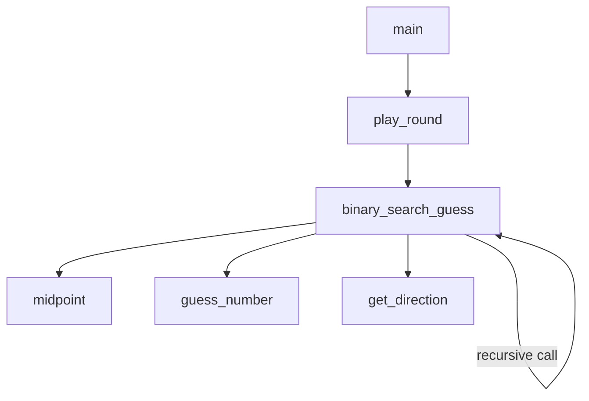

# number-guesser-python

A terminal number-guessing game where **you** think of a number and the **computer** guesses it using binary search.

## How it works

1. You think of a number between 1 and 100.
2. The computer guesses the midpoint (starts at 50).
3. You tell it whether the guess is correct.
4. If not, you tell it whether your number is higher or lower.
5. The computer narrows its range and guesses again.

Because it halves the range with every guess, the computer always finds the number in **7 guesses or fewer**.

## Run it

```bash
python3 number_guesser.py
```

## Example

```
Choose a number between 1 and 100
Is your number 50? (yes/no): no
Higher or Lower? higher
Is your number 75? (yes/no): no
Higher or Lower? higher
Is your number 88? (yes/no): no
Higher or Lower? lower
Is your number 81? (yes/no): yes
Got it! Nice one.
Wanna play again? (yes/no): no
Thanks for playing!
```

## Functions

| Function | Purpose |
| --- | --- |
| `main()` | Outer loop; runs rounds and handles "play again" |
| `play_round()` | Runs one full round of the game |
| `binary_search_guess(low, high, guesses_left)` | Recursive binary search core |
| `midpoint(low, high)` | Returns the middle of a range |
| `guess_number(current_guess)` | Asks if a guess is correct |
| `get_direction()` | Asks whether the number is higher or lower |

## Function flow



## The algorithm

The game is a live demonstration of **binary search**. Each guess splits the remaining range in half, so the number of guesses needed grows only with the *logarithm* of the range size:

- 1–100 → at most 7 guesses (`log₂(100) ≈ 6.6`)
- 1–1,000 → at most 10 guesses
- 1–1,000,000 → at most 20 guesses

## Requirements

- Python 3.6+
- No external dependencies