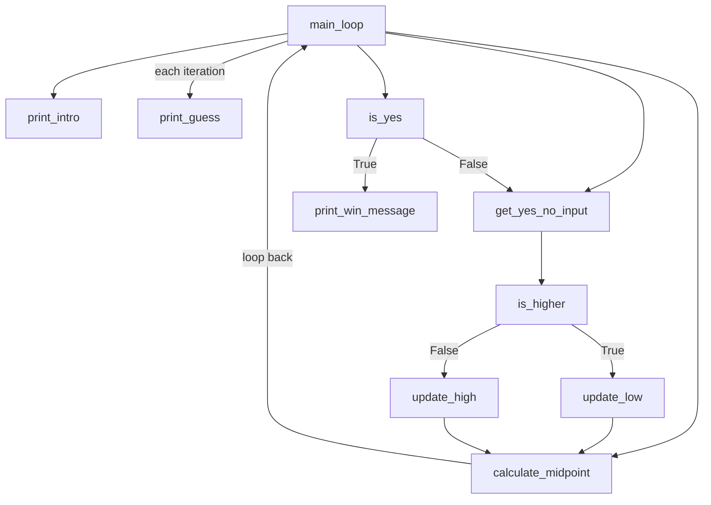

# Number Guesser

A simple terminal number guessing game — but flipped. Instead of you guessing a number the computer picked, **you** pick a whole number between 1 and 100, and the **program tries to guess it**.

Last updated: July 15, 2026

---

## The Rules

The rules of the game are simple: you, the user, choose a whole number that is between 1 and 100.

The program will prompt you in the terminal to say if the number it presents is the number you initially chose. You respond with **"Yes"** or **"No"**.

- If **"Yes"** → the game ends with a win message.
- If **"No"** → the program will ask if your number is **"Higher"** or **"Lower"** than its guess.

The program takes that response (higher or lower) and uses it to narrow down its next guess, then asks again. This repeats — looping until the program correctly guesses your number.

---

## How the Guessing Works

The program keeps track of a range (starting at 1 as the lower limit and 100 as the upper limit) and guesses the **midpoint** of that range each time.

- If you say **"Higher"** → the lower limit moves up to just above the last guess.
- If you say **"Lower"** → the upper limit moves down to just below the last guess.
- The program then recalculates the midpoint between the new limits — that's the next guess.

This repeats, narrowing the range in half each round, until the guess matches your number.

---

## How to Run It

1. Make sure the file is saved with a `.py` extension, e.g. `number-guesser-4.py`.
2. Open a terminal and navigate to the folder the file is in:
   ```bash
   cd path/to/your/folder
   ```
3. Run it:
   ```bash
   python number-guesser-4.py
   ```
   or, if that doesn't work:
   ```bash
   python3 number-guesser-4.py
   ```
4. Think of your number, then answer the prompts as they come.

---

## Code Structure

### Helper Functions
Each helper function does one specific thing only:

| Function | What it does |
|---|---|
| `get_yes_no_input(prompt)` | Gets raw user input, stripped and lowercased |
| `is_yes(response)` | Returns True if the response means yes |
| `is_higher(response)` | Returns True if the response means higher, False if lower |
| `calculate_midpoint(low, high)` | Returns the midpoint between the low and high bound |
| `update_low(guess)` | Returns the new low bound after a "Higher" response |
| `update_high(guess)` | Returns the new high bound after a "Lower" response |
| `print_guess(guess)` | Prints the question asking if the guess is correct |
| `print_intro()` | Prints the welcome message and rules |
| `print_win_message()` | Prints the "Good game!" message when the guess is correct |

### Main Loop
1. Print the intro.
2. Set `low = 1`, `high = 100`, and calculate the starting guess (the midpoint).
3. Loop:
   - Print the guess and ask Yes or No.
   - If Yes → print the win message and break out of the loop.
   - If No → ask Higher or Lower, update the low or high bound accordingly, and recalculate the midpoint for the next guess.
4. Repeat until the program correctly guesses the number.

---

## Function Flow



---

## Notes / Known Limitations

- The game assumes you answer Higher/Lower consistently and truthfully — if your answers contradict each other, the range could narrow incorrectly and the program may not converge on the right number.
- There's no restart option built in yet after a win — the program just prints the win message and ends. "Another round" would need to be added as a follow-up feature.