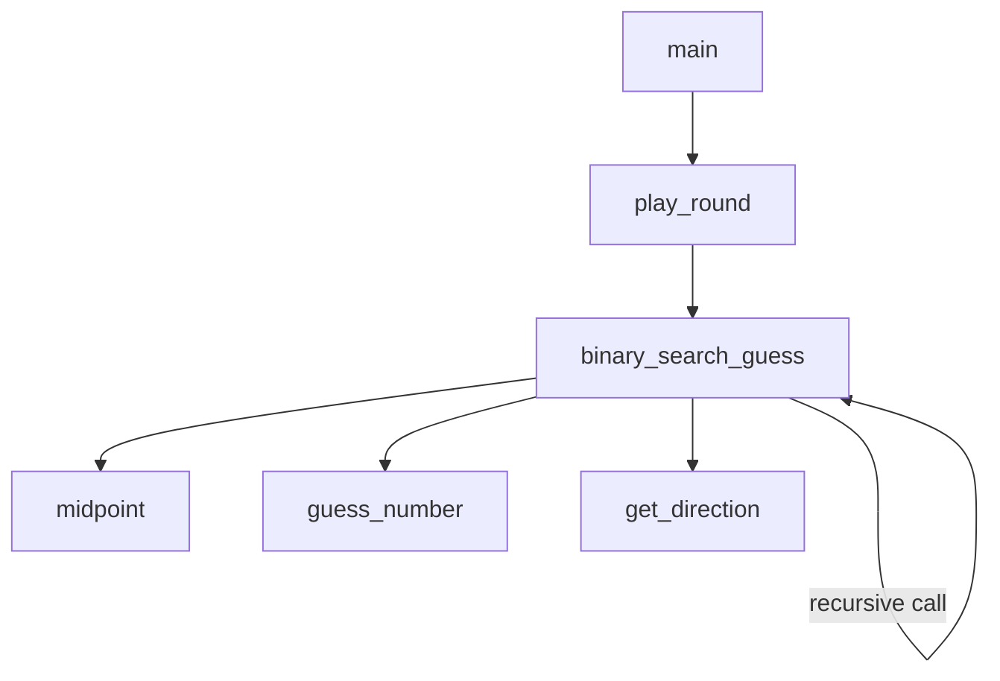

# Function flow / DRAFT 
Function flow for the number guesser program

```mermaid
flowchart TD
    %% Functions
    main

    play_round

    binary_search_guess

    midpoint
    guess_number
    get_direction

    %% Calls
    main --> play_round

    play_round --> binary_search_guess

    binary_search_guess --> midpoint
    binary_search_guess --> guess_number
    binary_search_guess --> get_direction
    binary_search_guess -->|"recursive call"| binary_search_guess
```